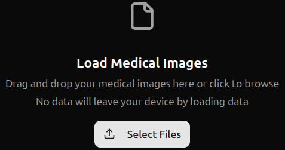
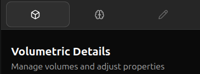
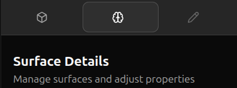
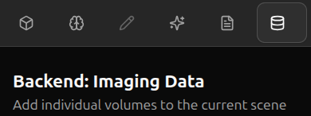
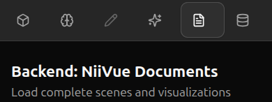
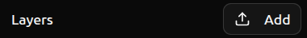

## Major Modes of operation
-------------------------------------------------------------------

FreeBrowse supports two major modes of operation
- Serverless
- Fullstack

Serverless mode is available at [github.com/freesurfer/freebrowse](github.com/freesurfer/freebrowse).  Fullstack mode is available by cloning the repository and following the installation instructions.

The following features are only available in Fullstack mode:
- Saving and retriving volumes and niivue documents to the backend
- AI intergration (experimental, work in progress)

## Loading data
-------------------------------------------------------------------

Data can either be loaded from disk, via URL or from the backend (Fullstack mode only)

### Loading data from disk

**Note**: When loading data from disk into freebrowse, **no data leaves your computer**.

#### Load a volume from disk

- When no data is loaded, you can click 'Select Files' in the center of the display, or drag volumetric files from your file browser.  Currelty, nifti (`.nii`, `.nii.gz`) and [`.mgz`](https://surfer.nmr.mgh.harvard.edu/fswiki/FsTutorial/MghFormat) are supported
  - 
- When data is already loaded, you can add volumetric data to the current scene by selecting the 'Volumetric Details' tab in the sidebar
  - 
  - And then selecting 'Load volumes'
  - 

#### Load a niivue document from disk

Niivue documents (`.nvd`) are json files that specify the composition of a scene and, optionally, contain the scene data as well.  Example niivue documents can be found in the `data/` folder of the github repository.  There are also some available [here](https://github.com/pwighton/freebrowse-test-data).

- When no data is loaded, you can click 'Select Files' in the center of the display, or drag niivue documents from your file browser.
  - 
- When data is already loaded, you can load a niivue document by selecting the 'Volumetric Details' tab in the sidebar
  - 
  - And then selecting 'Load volumes'
  - 
  - **Note:** When loading a volume via the 'Load volumes' button, the volume is *added* to the scene.  When loading a niivue document via the 'Load volumes' button, the scene defined by the niivue document *replaces* the current scene.
  - **Note:** Niivue documents designed for use with Fullstack mode (i.e. the `.nvd` files in [`data/local`](https://github.com/freesurfer/freebrowse/tree/main/data/local)) will fail to load when niivue is in Serverless mode.
   
#### Load a surface from disk

- To load a surface from disk, select the 'Surface Details' tab in the sidebar
  - 
  - And then select 'Load surfaces'
  - 
- Currently, [FreeSurfer-style surfaces](http://www.grahamwideman.com/gw/brain/fs/surfacefileformats.htm) (e.g. `lh.white`, `rh.pial`) are supported
 
### Loading data via URL

The URL parameters `vol` and `nvd` can be used to generate links that will automatically load data.  Simply append `?vol=<url>` or `?nvd=<url>` to the FreeBrowse URL to automatically load the corresponding volume or niivue document.

#### Examples of loading volumes via URL

- [This URL](https://freesurfer.github.io/freebrowse/?vol=https://raw.githubusercontent.com/pwighton/freebrowse-test-data/main/freesurfer/orig.nii.gz) will load [this file](https://github.com/pwighton/freebrowse-test-data/blob/main/freesurfer/orig.nii.gz)
  - **Note:** to reference a file on github, the [`raw.githubusercontent.com`](https://stackoverflow.com/questions/39065921/what-do-raw-githubusercontent-com-urls-represent) URL must be used.
- [This URL](https://freesurfer.github.io/freebrowse/?vol=https://s3.amazonaws.com/openneuro.org/ds002785/derivatives/freesurfer/sub-0001/mri/orig.mgz) will load the `orig.mgz` file from the `derivatives/freesurfer` folder for `sub-0001` of the [openneuro dataset ds002785](https://openneuro.org/datasets/ds002785)

#### Examples of loading niivue documents via URL

- [This URL](https://freesurfer.github.io/freebrowse/?nvd=https://raw.githubusercontent.com/freesurfer/freebrowse/main/data/remote/mni152-hippo.nvd) will load the [this niivue document](https://github.com/freesurfer/freebrowse/blob/main/data/remote/mni152-hippo.nvd) from the FreeBrowse github repository
- [This URL](https://freesurfer.github.io/freebrowse/?nvd=https://raw.githubusercontent.com/pwighton/freebrowse-test-data/main/openneuro/ds002785/sub-0001.nvd) will load [this niivue document](https://github.com/pwighton/freebrowse-test-data/blob/main/openneuro/ds002785/sub-0001.nvd) which was sutomatically generated using [this openneuro crawler](https://github.com/pwighton/openneuro-crawl) (work-in-progress)
- **Note:** to reference a file on github, the [`raw.githubusercontent.com`](https://stackoverflow.com/questions/39065921/what-do-raw-githubusercontent-com-urls-represent) URL must be used.
  - **Note:** Niivue documents designed for use with Fullstack mode (i.e. the `.nvd` files in [`data/local`](https://github.com/freesurfer/freebrowse/tree/main/data/local)) will fail to load when niivue is in Serverless mode.
  
### Loading data from the backend (Fullstack mode only)

When running FreeBrowse in Fullstack mode, volumes and niivue documents can be loaded from the backend.  By default, the `/data/` folder of the repository is served by the backend webserver (the folder location can be changed via the [`DATA_DIR` environment variable in `pixi.toml`](https://github.com/freesurfer/freebrowse/blob/88493596a6d598348902925abce18eeaf2e941cb/backend/pixi.toml#L19)).  Any volumetric file (`.nii`, `.nii.gz`, `.mgz`) or niivue document (`.nvd`) can be loaded directly from the backend

#### Load a volume from the backend

- To load a volume from the backend, select the 'Backend: Imaging Data` tab in the sidebar
- 
- Select the volume you wish to load
- The volume will be *added* to the scene

#### Load a niivue document from the backend

- To load a niivue document from the backend, select the 'Backend: NiiVue Documents' tab in the sidebar
- 
- Select the niivue document you wish to load
- The scene defined by the niivue document will *replace* the current scene

## Saving data
-------------------------------------------------------------------

Data can either be saved to disk or, in Fullstack mode, to the backend.

### Saving data to disk

- Saving volumes
- Saving niivue documents

### Saving data to the backend

- Saving volumes
- Saving niivue documents

### Notes

- Explain differences between saving niivue documents to disk vs backend
- Since editing of surfaces is not supported, saving of surfaces is not supported

## Navigation
-------------------------------------------------------------------

### Top panel

- View Modes
- Drag Modes
- Settings

### Sidebar

- Volumetric Details
- Surface Details
- Drawing Tools
- AI annotation (Fullstack mode only)
- Backend: NiiVue Documents (Fullstack mode only)
- Backend: Imaging Data (Fullstack mode only)

### Footer

## Working with Volumes
-------------------------------------------------------------------

## Working with Surfaces
-------------------------------------------------------------------

#### Adding a surface layer

**PW move to 'working with surfaces'?**

- After a surface has been loaded, a FreeSurfer-style surface overlay can be added to a surface.  Select the 'Surface Details' tab in the sidebar
  - 
  - Select the surface you wish to add a overlay layer to
  - Select the 'Add ' button next to 'Layers'
  - 
  
## AI Annotation (experimental)
-------------------------------------------------------------------

## Other Modes of operation
-------------------------------------------------------------------

- Singlefile
- Jupyter

